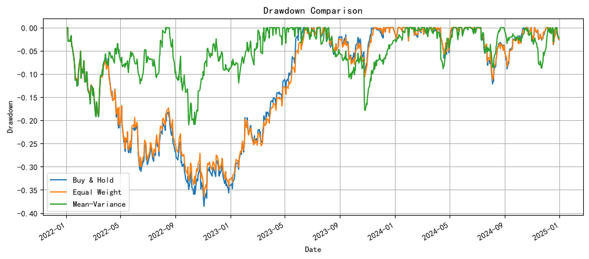
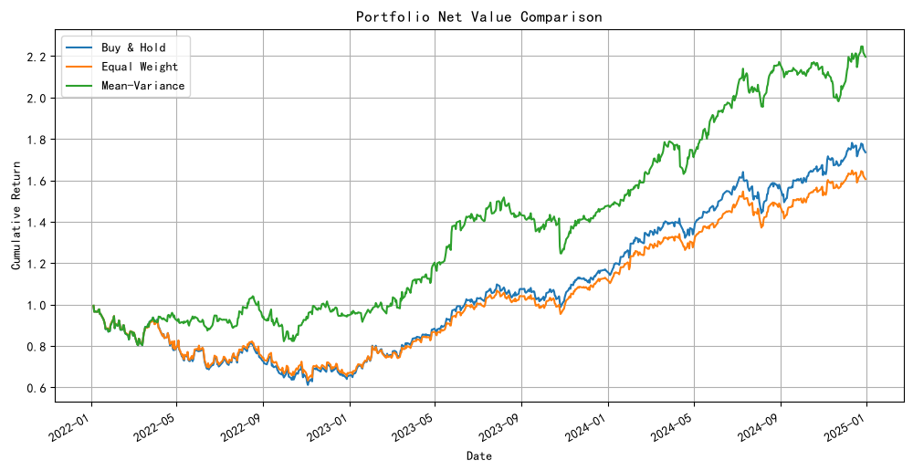

# Simple Mean-Variance Portfolio Backtester

## Project Overview

This project implements a rolling-window mean-variance portfolio backtesting system, comparing strategies such as Equal Weight, Buy & Hold, and Markowitz optimization using real U.S. stock market data.

## Key Features

Fetch historical data for multiple stocks via yfinance

Implement rolling-window Mean-Variance Optimization

Support periodic rebalancing

Comprehensive performance evaluation including annualized return, volatility, Sharpe ratio, and maximum drawdown

Visualization of net asset value curves and drawdowns

## Strategy Details

#### 1.Buy & Hold

Initial weights are set equally.
No rebalancing is performed throughout the backtest period.

#### 2.Equal Weight

Starts with equal weights.
Rebalances back to equal weights every 20 trading days.

#### 3.Mean-Variance Optimization

Lookback window: 60 trading days
Rebalancing frequency: every 20 trading days
Optimization objective: Maximize Sharpe ratio
Constraints: weights sum to 1 and each weight is from 0 to 1 (long-only, no short-selling)
Mean returns and covariance matrix are annualized using 252 trading days.
Risk-free rate is fixed at 2% per year.

## Main Results

### Drawdown Comparison

The Mean-Variance strategy shows better downside control, with a maximum drawdown of approximately -21.0%, outperforming both Buy & Hold and Equal Weight strategies.

### Net Value Comparison

The Mean-Variance portfolio achieves a higher terminal net value compared with the two benchmark strategies over the test period.

## Limitation

Transaction costs and market impact are not included. Therefore, reported returns and net asset values are likely overstated relative to live trading.
The risk-free rate is assumed constant at 2%.
Covariance matrix is estimated using a simple rolling window without shrinkage or other robust techniques, which may lead to estimation error.
The stock universe is small and consists of large-cap U.S. stocks, so results may not generalize to broader markets.

## Tech Stack

Python, Pandas, NumPy, SciPy, Matplotlib, yfinance
