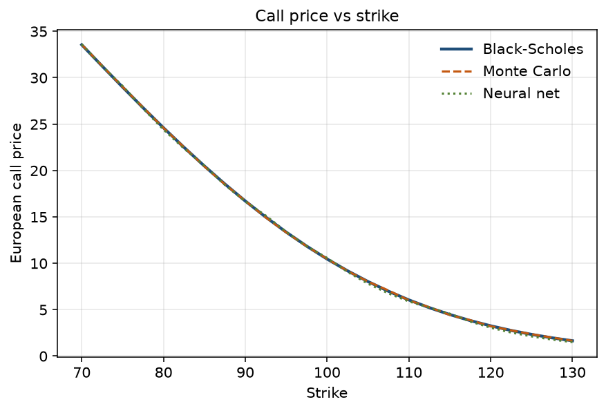
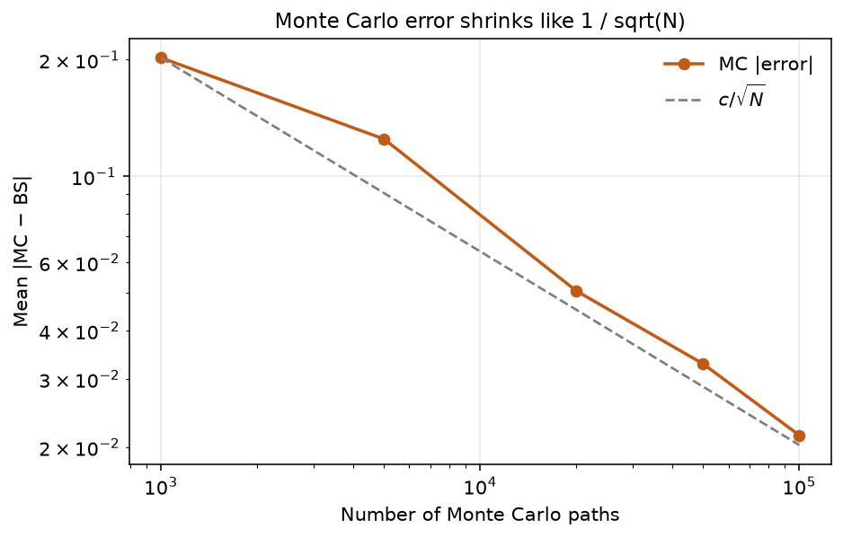
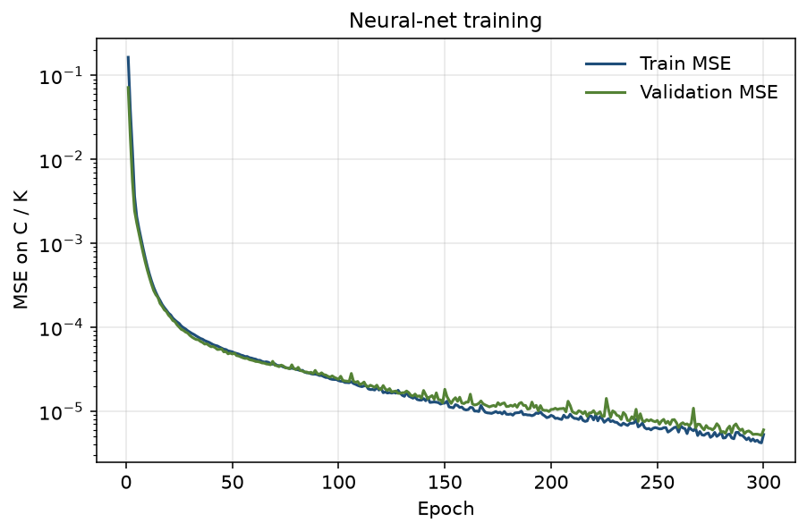
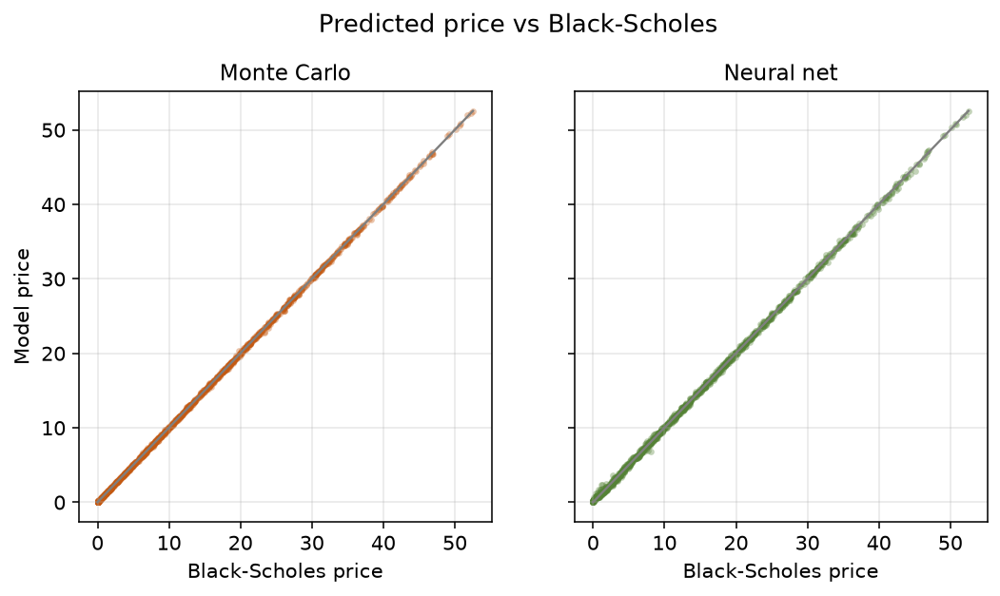
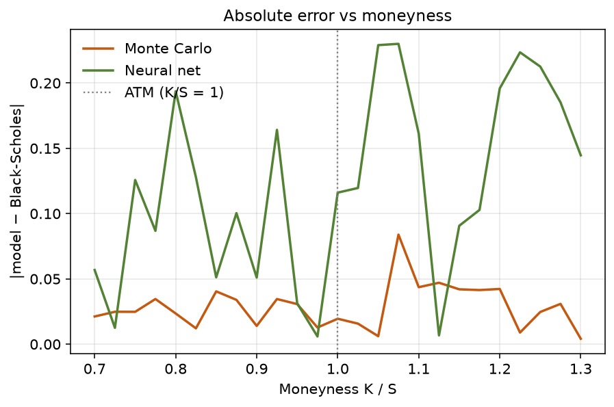

# European Call Pricing: Black-Scholes vs Monte Carlo vs Neural Net

A small, reproducible study that asks a single question:

> Under the Black-Scholes assumptions, how much do a closed-form price, a Monte Carlo price, and a small neural network differ when they value the same European call?

The three methods are not competing “market models.” They live in the same geometric-Brownian-motion world. Black-Scholes is treated as the exact benchmark. Monte Carlo and the network are two different ways of approximating that benchmark, and the gaps have different causes.

Results below come from `python -m option_pricing_comparison` with seed `42`. They are research output for personal project, not trading advice.

## 1. Research purpose

Black-Scholes gives a formula for a European call when the underlying follows GBM with constant interest rate `r` and volatility `σ`. Two common numerical tools try to recover the same price:

1. **Monte Carlo** simulates many terminal stock prices and averages the discounted payoff.
2. **A neural net** learns a map from contract features to price.

This project measures those gaps on synthetic contracts, then explains them. The design is intentionally beginner-level: one product, one process, no market data, and no implied-volatility smile.

## 2. Methods

### 2.1 Black-Scholes (benchmark)

```text
d1 = [ln(S/K) + (r + σ²/2) T] / (σ √T)
d2 = d1 - σ √T
C  = S N(d1) - K e^{-rT} N(d2)
```

`N` is the standard normal CDF. If `T` is numerically zero, the code returns the intrinsic value `max(S − K, 0)`. A put-call parity check `C − P = S − K e^{-rT}` is run on the at-the-money benchmark; the gap is `0` at double precision.

### 2.2 Monte Carlo

The GBM solution at expiry is exact (no time-stepping error):

```text
S_T = S exp((r − σ²/2) T + σ √T Z),   Z ~ N(0,1)
C   = e^{-rT} * mean(max(S_T − K, 0))
```

The price is the discounted mean payoff. Independent paths would have standard error `std(discounted) / √N`, but the default pricer uses antithetic variates (`Z` and `−Z`). Those pairs are negatively correlated, so the reported SE is the standard error of the pair averages, not of all `N` raw paths. Default comparison: `N = 50,000` paths on a strike grid; `N = 20,000` on the held-out test set. A separate sweep `N ∈ {1k, 5k, 20k, 50k, 100k}` shows how error scales.

### 2.3 Neural net

The network does not see market quotes. It is trained to copy Black-Scholes.

| Item | Choice |
| --- | --- |
| Inputs | `S/K`, `T`, `r`, `σ` (then standardized) |
| Target | `C/K` (price over strike); multiply by `K` at prediction time |
| Architecture | `4 → 32 → 32 → 1`, ReLU hidden layers, Softplus output |
| Loss / optimizer | MSE / Adam (`lr = 1e-3`) |
| Data | 8,000 random contracts, 70% / 15% / 15% train / val / test |
| Training box | `S ∈ [80, 120]`, `K ∈ [70, 130]`, `T ∈ [0.1, 2]`, `r ∈ [0.01, 0.08]`, `σ ∈ [0.10, 0.40]` |

Training uses `loss.backward()` in PyTorch (backpropagation). A second set with `σ ∈ [0.45, 0.60]` is never trained on; it is only used to show what happens under extrapolation.

### 2.4 Metrics

MAE, RMSE, and max absolute error versus Black-Scholes. Mean and median relative error are computed only where `|C_BS| ≥ 0.05`, because a few-cent gap on a nearly worthless out-of-the-money call would dominate a raw percentage.

## 3. How to run

```bash
pip install -r option_pricing_comparison/requirements.txt
python -m option_pricing_comparison
```

Useful flags: `--epochs 300`, `--mc-paths 50000`, `--seed 42`, `--output-dir PATH`. Outputs land in `option_pricing_comparison/output/`.

```text
option_pricing_comparison/
  black_scholes.py   closed-form call / put and parity
  monte_carlo.py     vectorized GBM paths and discounted payoff
  dataset.py         random contracts and train/val/test split
  neural_net.py      tiny MLP, Adam, backpropagation
  compare.py         MAE / RMSE / relative error
  visualize.py       five figures
  pipeline.py        end-to-end study
```

## 4. Results

Benchmark contract: `S = 100`, `K = 100`, `T = 1`, `r = 5%`, `σ = 20%`.

| Method | ATM call price |
| --- | ---: |
| Black-Scholes | 10.451 |
| Monte Carlo (50,000 paths) | 10.470 |
| Neural net | 10.567 |

### Price vs strike

The three curves sit on top of each other. Monte Carlo noise is small at 50,000 paths. The network follows the same downward-sloping shape, with a slightly larger local wiggle.



On this 25-strike slice:

| Method | MAE | RMSE | Mean relative error |
| --- | ---: | ---: | ---: |
| Monte Carlo | 0.029 | 0.033 | 0.45% |
| Neural net | 0.121 | 0.140 | 2.50% |

### Monte Carlo convergence

ATM absolute error, averaged over 8 independent runs, falls from **0.202** at 1,000 paths to **0.021** at 100,000 paths — a **9.4×** drop when `N` grows 100×. The `1/√N` rule predicts 10×, so the sweep matches the expected rate.



### Neural-net training

Train and validation MSE on `C/K` fall together. The best checkpoint is epoch 299 (validation MSE `5.1e-6`). The network is learning a smooth formula, not memorizing noise.



### Predicted price vs Black-Scholes

Held-out test contracts (`n = 1,200`). Monte Carlo here uses **20,000** paths per contract. Both methods hug the 45-degree line. Monte Carlo scatter is tighter; the network is slightly noisier, especially on cheap calls. Median relative error is over the 1,169 contracts with `|C_BS| ≥ 0.05`.



| Method (test set) | MAE | RMSE | Median relative error |
| --- | ---: | ---: | ---: |
| Monte Carlo (20,000 paths) | 0.065 | 0.100 | 0.44% |
| Neural net | 0.165 | 0.215 | 1.13% |

### Error vs moneyness

On the fixed-`(S, T, r, σ)` strike grid, Monte Carlo error stays a few cents across `K/S`. Network error is larger and less regular: a small MLP does not reproduce the formula to machine precision, so the residual wiggles with strike.



### Extrapolation

When volatility is drawn from `[0.45, 0.60]` (outside the training box `[0.10, 0.40]`), neural-net MAE rises to **0.673** about four times the in-box test MAE of 0.165 (`n = 400`). This check is for the network only. Monte Carlo was not re-run on that extra-σ set. By construction MC has no training box, it still prices the GBM it is given, with sampling error only.

## 5. Why the three methods differ

Black-Scholes, Monte Carlo, and the network are answering the same mathematical question. The gaps are not evidence of three different option models.

- **Monte Carlo vs Black-Scholes.** Monte Carlo is an unbiased estimator of the same expectation. The residual is sampling noise. More paths shrink it at rate `1/√N`. There is no time-discretization bias here because `S_T` is simulated with the exact GBM solution.
- **Neural net vs Black-Scholes.** The network is a function approximator with a few thousand weights. Error comes from limited capacity, finite training data, and the shape of the training box. On the fixed-maturity strike slice the residual wiggles with `K` rather than being smallest at-the-money. Relative error is larger on cheap out-of-the-money calls, and MAE grows when parameters leave the training box.
- **Monte Carlo vs neural net.** They do not converge to each other except insofar as both approach Black-Scholes. Adding paths helps Monte Carlo. Adding a wider training range,or a slightly larger network helps the MLP. Those knobs are not interchangeable.

## 6. Limitations

- European calls only. American early exercise is not priced.
- Constant `r` and `σ`. No jumps, local volatility, or implied-volatility smile.
- Synthetic GBM data only. The network learns the Black-Scholes map, not market prices.
- No bid-ask spread, fees, or discrete dividends.
- Relative error on deep out-of-the-money calls is unstable; the write-up therefore leans on MAE and on relative error with a price floor.

## 7. Reproducibility

Default seed `42` for NumPy and PyTorch. Figures and tables in `output/` are regenerated by the command in section 3.


